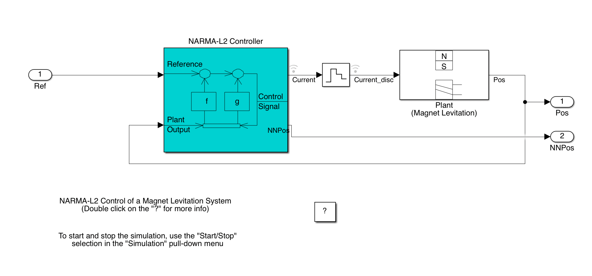
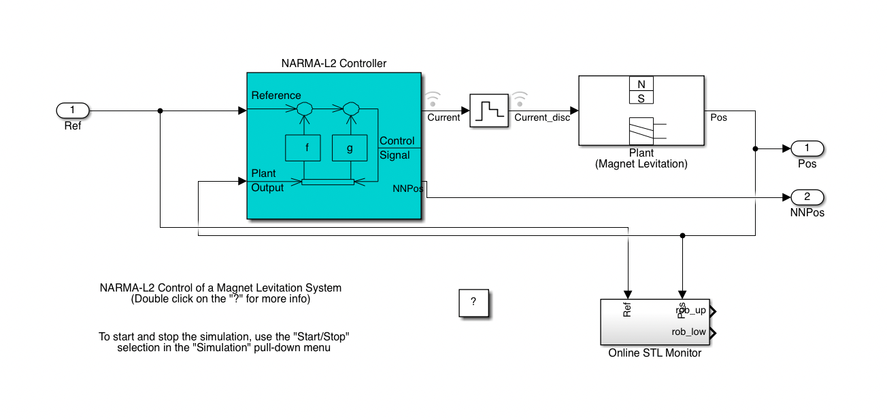
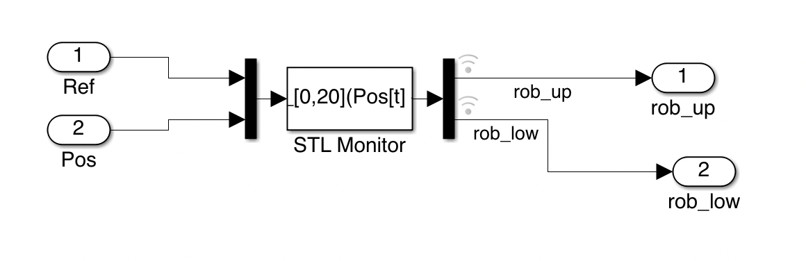

# Online Causation Monitoring for Neural Network Controller Model

We use this neural network controller model, to illustrate how our tool can be adapted to new Simulink models.

***

## The original model



## Steps to instrument the model
- Create a `subsystem` block and connect the output signals with the block input ports;
- Go inside the `subsystem` block, create an `S-function` block, `mux` block, `demux` block, two `OutPort` blocks respectively named as `rob_up` and `rob_low`, and connect their ports
- For the `S-function` block, create a mask:
   - In `Icon&Ports` tab,
      - set `Run Initialization` as `Analyze`
      - input `fprintf('%s', STLString)` in the dialog box
   - In `Parameters&Dialog` tab,
      - add an Edit named `SignalNames`, with value as the signal names. Here, the value is `Pos, Ref`
      - add an Edit named `STLString`, with value as `phi_xx`. Here, the value is `phi_NN`
      - add an Edit named `MaxRob`, with value as `max_rob`
      - add an Edit named `Refresh`, with value as the refresh rate of the model. Here the value is `0.01`
      - add an Edit named `Diagnose`, with value as `diagnoser`
   - In `Documentation` tab, write the necessary documentation.
- Then, we need to write and execute some code to feed the STL formula to the `S-function` block. Here is an example:
    ```
    mdl = 'NN_online';
    u_ts=0.001;
    max_rob = 10;
    diagnoser = 0;
    input = [2.4 1.2 1.8 2.6];
    phi_NN = 'alw_[0,20](Pos[t] < 3)';
    NN = BreachSimulinkSystem(mdl);
    input_gen.type = 'UniStep';
    input_gen.cp = 4;
    NN.SetInputGen(input_gen);
    d = 0;
    diagnoser = d;
    times = 1;
    NN.SetParam({'Ref_u0', 'Ref_u1', 'Ref_u2', 'Ref_u3'}, input);
    NN.SetParam({'max_rob', 'diagnoser'}, [max_rob, d]);
    ```
   By this, the `S-Function` block is initialized with an STL formula ` phi_NN = alw_[0,20](Pos[t] < 3)`.
- Then, open the model again, right click the `S-function` block, select `Block Parameters`
   - `S-function name` : `“onlineMonitorWrapper”`
   - `S-function parameters` : `“SignalNames, STLString, MaxRob, Refresh, Diagnose”`
- Lastly, complement the script and run it.
    ```
    tic
    for i = 1:times
       NN.ResetSimulations();
       NN.Sim(0:.01:30);
    end
    simTime = toc;
    one_sim_time = simTime/times;

    Trace = NN.GetTraces();
    idx = FindParam(NN.Sys, {'rob_low', 'rob_up'});
    t = Trace{1}.time;

    close
    figure;
    subplot(2,1,1)
    plot(t,Trace{1}.X(4,:)', 'LineWidth', 2);
    set(gca, 'LineWidth', 2, 'FontSize',18)
    legend({'Pos'});
    grid on;
    xlim([0 30]);
    xticks(0:5:30);
    g = title(phi_NN);
    set(g,'Interpreter','None')
    subplot(2,1,2);
    hold on;

    stairs(t, Trace{1}.X(idx(2),:)', 'LineWidth', 2);
    stairs(t, Trace{1}.X(idx(1),:)', 'LineWidth', 2);
    xlim([0 20]);
    xticks(0:5:20);
    ylim([-max_rob max_rob]);
    set(gca, 'LineWidth', 2, 'FontSize',18)
    set(gcf,'position',[10,10,800,500])
    legend({'Upper robustness','Lower robustness'});
    grid on;
    ```

## The model after modification


